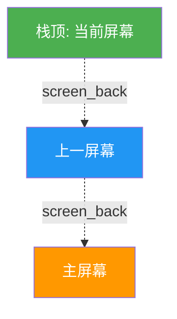

# UI界面开发指南

> **基于 template_screen 模板的快速UI开发教程**

本文档详细介绍如何基于 `template_screen` 模板文件创建新的UI界面，并通过栈管理系统集成到TuyaOpen AI Pocket Pet项目中。

---

## 目录

- [UI界面开发指南](#ui界面开发指南)
  - [目录](#目录)
  - [开发前推荐：使用 LVGL PC 模拟器](#开发前推荐使用-lvgl-pc-模拟器)
    - [推荐工具](#推荐工具)
  - [1. 核心概念](#1-核心概念)
    - [栈式屏幕管理](#栈式屏幕管理)
    - [Screen\_t 结构体](#screen_t-结构体)
  - [2. 模板文件说明](#2-模板文件说明)
  - [3. 快速开发新界面](#3-快速开发新界面)
    - [步骤1: 复制模板](#步骤1-复制模板)
    - [步骤2: 重命名](#步骤2-重命名)
    - [步骤3: 实现UI](#步骤3-实现ui)
    - [步骤4: 事件处理](#步骤4-事件处理)
    - [步骤5: 清理资源](#步骤5-清理资源)
  - [4. 集成调用](#4-集成调用)
  - [5. 常见问题](#5-常见问题)

---

## 开发前推荐：使用 LVGL PC 模拟器

在嵌入式开发前，**强烈建议使用PC模拟器**先设计UI，可以大幅提升开发效率。

### 推荐工具

**项目地址**: [https://github.com/lvgl/lv_port_pc_vscode](https://github.com/lvgl/lv_port_pc_vscode)

**优势**：
-  快速迭代 - 无需烧录硬件
-  即时预览 - 实时查看效果
-  方便调试 - 使用VS Code调试器

**快速开始**：
```bash
git clone https://github.com/lvgl/lv_port_pc_vscode.git
cd lv_port_pc_vscode
# Ubuntu: sudo apt-get install build-essential libsdl2-dev
code .  # 在VS Code中打开，按F5运行
```

**开发流程**：


**注意**：PC模拟器中设置屏幕尺寸为 `384x168` 以匹配目标设备。

---

## 1. 核心概念

### 栈式屏幕管理

项目使用**栈（Stack）管理屏幕**，类似浏览器的前进后退。



**操作示例**：
```c
screen_load(&settings_screen);  // 跳转到设置屏幕
screen_back();                   // 返回上一屏幕
```

### Screen_t 结构体

每个屏幕必须实现这个结构：

```c
Screen_t my_screen = {
    .init = my_screen_init,        // 初始化函数
    .deinit = my_screen_deinit,    // 清理函数
    .screen_obj = &ui_my_screen,   // LVGL对象指针
    .name = "my_screen",           // 屏幕名称
};
```

---

## 2. 模板文件说明

模板文件位置：`src/display/ui/template_screen.c` 和 `.h`

**核心结构**：

```c
// 头文件 template_screen.h
#ifndef TEMPLATE_SCREEN_H
#define TEMPLATE_SCREEN_H

#include "screen_manager.h"

extern Screen_t template_screen;

void template_screen_init(void);
void template_screen_deinit(void);

#endif
```

```c
// 源文件 template_screen.c 的关键部分

static lv_obj_t *ui_template_screen;  // LVGL对象

Screen_t template_screen = {
    .init = template_screen_init,
    .deinit = template_screen_deinit,
    .screen_obj = &ui_template_screen,
    .name = "template",
};

void template_screen_init(void)
{
    // 1. 创建屏幕
    ui_template_screen = lv_obj_create(NULL);
    lv_obj_set_size(ui_template_screen, 384, 168);
    
    // 2. 创建UI元素
    lv_obj_t *title = lv_label_create(ui_template_screen);
    lv_label_set_text(title, "Template Screen");
    
    // 3. 注册事件
    lv_obj_add_event_cb(ui_template_screen, keyboard_event_cb, 
                        LV_EVENT_KEY, NULL);
    
    // 4. 设置焦点（必须！）
    lv_group_add_obj(lv_group_get_default(), ui_template_screen);
    lv_group_focus_obj(ui_template_screen);
}

void template_screen_deinit(void)
{
    // 清理资源
    if (ui_template_screen) {
        lv_obj_remove_event_cb(ui_template_screen, keyboard_event_cb);
        lv_group_remove_obj(ui_template_screen);
    }
}

static void keyboard_event_cb(lv_event_t *e)
{
    uint32_t key = lv_event_get_key(e);
    switch (key) {
        case KEY_ESC:
            screen_back();  // 返回
            break;
        // 处理其他按键...
    }
}
```

---

## 3. 快速开发新界面

### 步骤1: 复制模板

```bash
cd src/display/ui/
cp template_screen.c my_new_screen.c
cp template_screen.h my_new_screen.h
```

### 步骤2: 重命名

使用查找替换功能，将以下内容全部替换：

| 原名称 | 新名称 |
|-------|-------|
| `template_screen` | `my_new_screen` |
| `TEMPLATE_SCREEN` | `MY_NEW_SCREEN` |
| `ui_template_screen` | `ui_my_new_screen` |
| `template_screen_init` | `my_new_screen_init` |
| `template_screen_deinit` | `my_new_screen_deinit` |

### 步骤3: 实现UI

在 `my_new_screen_init()` 中设计你的UI：

```c
void my_new_screen_init(void)
{
    // 1. 创建屏幕
    ui_my_new_screen = lv_obj_create(NULL);
    lv_obj_set_size(ui_my_new_screen, 384, 168);
    
    // 2. 添加UI元素
    lv_obj_t *title = lv_label_create(ui_my_new_screen);
    lv_label_set_text(title, "My Screen");
    lv_obj_align(title, LV_ALIGN_CENTER, 0, 0);
    
    // 3. 注册事件
    lv_obj_add_event_cb(ui_my_new_screen, keyboard_event_cb, 
                        LV_EVENT_KEY, NULL);
    
    // 4. 设置焦点（必须！）
    lv_group_add_obj(lv_group_get_default(), ui_my_new_screen);
    lv_group_focus_obj(ui_my_new_screen);
}
```

### 步骤4: 事件处理

实现键盘事件：

```c
static void keyboard_event_cb(lv_event_t *e)
{
    uint32_t key = lv_event_get_key(e);
    
    switch (key) {
        case KEY_UP:
        case KEY_DOWN:
            // 处理导航
            break;
        case KEY_ENTER:
            // 处理确认
            break;
        case KEY_ESC:
            screen_back();  // 返回
            break;
    }
}
```

### 步骤5: 清理资源

实现 `deinit()` 函数：

```c
void my_new_screen_deinit(void)
{
    if (ui_my_new_screen) {
        lv_obj_remove_event_cb(ui_my_new_screen, keyboard_event_cb);
        lv_group_remove_obj(ui_my_new_screen);
    }
    // 如果有定时器，记得删除
    if (timer) {
        lv_timer_del(timer);
        timer = NULL;
    }
}
```

---

## 4. 集成调用

新界面开发完成后，只需在需要的地方调用即可：

```c

screen_load(&my_new_screen);
```

**注意**：由于使用了 `aux_source_directory`，新文件会自动编译，无需修改 CMakeLists.txt。

---

## 5. 常见问题

**Q1: 屏幕不响应按键？**
- 检查是否调用了 `lv_group_add_obj()` 和 `lv_group_focus_obj()`

**Q2: 内存泄漏？**
- 确保 `deinit()` 函数中删除了所有定时器和事件回调

**Q3: 界面显示异常？**
- 检查对象尺寸是否超出屏幕 (384x168)
- 确认父对象关系正确
