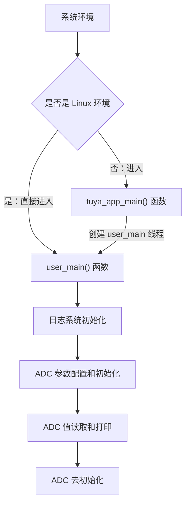

ADC（Analog-to-Digital Converter）是一种将**连续模拟信号**转换为**离散数字信号**的器件。它通过采样和量化过程，将模拟电压值转换为数字代码，广泛应用于传感器数据采集、电池电压监测、音频处理等场景。ADC 的性能关键指标包括分辨率、采样率、精度和线性度。

本示例的代码主要向开发者演示 ADC 的单次采集数据的用法。关于 ADC 接口的详细说明请查看: [TKL_ADC](https://www.tuyaopen.ai/zh/docs/tkl-api/tkl_adc)。

## 使用指导

### 前置条件

由于每个开发平台上的资源不一样，并不会支持所有外设。
在编译运行该示例代码前，您需要检查 `board/<目标开发平台，如 T5AI>/TKL_Kconfig` 中确认使能配置是否默认打开：

```shell
config ENABLE_ADC
    bool
    default y
```
 在运行本示例工程前要确认基础的 [环境搭建](https://www.tuyaopen.ai/zh/docs/quick-start/enviroment-setup) 已经完成。

- **硬件配置**

  ADC的端口，通道，模式等配置是通过宏写在源文件 ( `examples/peripherals/adc/src/example_adc.c` )的头部。如果想要修改配置，请自行在源文件中修改。

  ```c
  /***********************************************************
  *************************micro define***********************
  ***********************************************************/
  #define EXAMPLE_ADC_PORT             TUYA_ADC_NUM_0
  #define EXAMPLE_ADC_CHANNEL          2
  #define EXAMPLE_ADC_MODE             TUYA_ADC_CONTINUOUS
  #define EXAMPLE_ADC_TYPE             TUYA_ADC_INNER_SAMPLE_VOL
  ```

- **硬件连接**

  根据外设配置将 ADC 检测引脚接在待测引脚上。例，如果使用的是默认设置，可以将 ADC2 引脚接高电平。

### 选择工程配置文件

在编译示例工程之前需要根据自己的目标开发平台选择对应的配置文件。

- 进入本示例工程目录（假设当前路径是在 TuyaOpen 仓库的根目录下）, 请执行以下命令：

  ```shell
  cd examples/peripherals/adc 
  ```

- 进入选择配置文件的菜单，请执行以下命令：

  ```shell
  tos.py config choice
  ```

  命令执行完成后，终端会显示类似以下界面：

  ```
  --------------------
  1. BK7231X.config
  2. ESP32-C3.config
  3. ESP32-S3.config
  4. ESP32.config
  5. EWT103-W15.config
  6. LN882H.config
  7. T2.config
  8. T3.config
  9. T5AI.config
  10. Ubuntu.config
  --------------------
  Input "q" to exit.
  Choice config file: 
  ```

- 根据目标开发平台输入对应配置文件的编号然后按回车键。如选择 T5AI 平台，请输入数字 “9” 后按回车键，终端会显示以下界面：

  ```shell
  Choice config file: 9
  [INFO]: Initialing using.config ...
  [NOTE]: Choice config: /home/share/samba/TuyaOpen/boards/T5AI/config/T5AI.config
  ```

### 运行准备

- **参数配置**

  ADC的端口，通道，模式等配置是通过宏写在源文件 ( `./src/example_adc.c` )的头部。如果想要修改配置，请自行在源文件中修改。

  ```c
  /***********************************************************
  *************************micro define***********************
  ***********************************************************/
  #define EXAMPLE_ADC_PORT             TUYA_ADC_NUM_0
  #define EXAMPLE_ADC_CHANNEL          2
  #define EXAMPLE_ADC_MODE             TUYA_ADC_CONTINUOUS
  #define EXAMPLE_ADC_TYPE             TUYA_ADC_INNER_SAMPLE_VOL
  ```

- **硬件连接**

  根据外设配置将 ADC 检测引脚接在待测引脚上。例，如果使用的是默认设置，可以将 ADC2 引脚接高电平。

### 编译烧录

- 编译工程，请执行以下指令：

  ```
  tos.py build
  ```

  工程编译成功后，终端会出现类似以下界面:

  ```
  [NOTE]: 
  ====================[ BUILD SUCCESS ]===================
   Target    : adc_QIO_1.0.0.bin
   Output    : /home/share/samba/TuyaOpen/examples/peripherals/adc/dist/adc_1.0.0
   Platform  : T5AI
   Chip      : T5AI
   Board     : TUYA_T5AI_BOARD
   Framework : base
  ========================================================
  ```

- 烧录固件，请执行以下指令：

  ```
  tos.py flash
  ```

### 运行结果

- 查看日志，请执行以下指令：

  ```
  tos.py monitor
  ```

  如果烧录和查看日志的步骤出现问题，请阅读 [烧录和日志](https://www.tuyaopen.ai/zh/docs/quick-start/firmware-burning) 。

- 终端界面会打印采集到的 ADC 值，如下：

  ```
  [01-01 00:01:34 TUYA D][lr:0x70309] ADC0 value = 4049
  ```

## 示例说明

### 流程图



### 流程说明

1. 系统初始化：如果是 Linux 环境，直接调用 user_main()。其他环境则进入 tuya_app_main() 创建 user_main() 线程。
2. 调用 tal_log_init() 初始化日志系统。
3. 调用 tkl_adc_init() 初始化 ADC 功能。
4. 单次读取 ADC 原始值并打印。
5. 调用 tkl_adc_deinit() 关闭 ADC。

## 技术支持

您可以通过以下方法获得涂鸦的支持:

- TuyaOpen：https://www.tuyaopen.ai/zh

- GitHub：https://github.com/tuya/TuyaOpen
