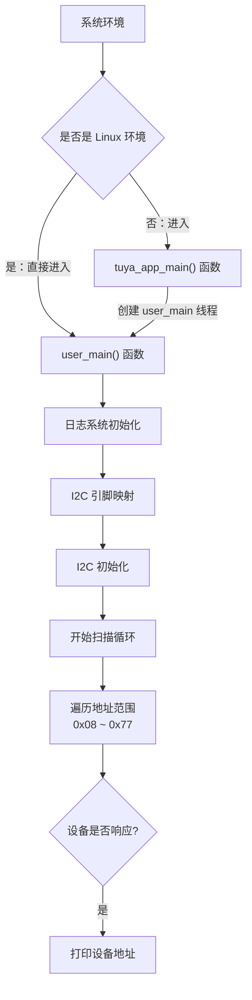

I2C（Inter-Integrated Circuit）即集成电路总线，是一种**串行通信协议**，用于连接微控制器和各种外设。I2C 使用两根信号线（SDA数据线和SCL时钟线）实现多主机、多从机的通信。在实际项目开发中，经常需要检测 I2C 总线上连接了哪些设备，以及这些设备的地址是什么。

本示例的代码主要向开发者演示如何扫描 I2C 总线上的所有设备，并显示检测到的设备地址。关于 I2C 接口的详细说明请查看: [TKL_I2C](https://www.tuyaopen.ai/zh/docs/tkl-api/tkl_i2c)。

## 使用指导

### 前置条件

由于每个开发平台上的资源不一样，并不会支持所有外设。
在编译运行该示例代码前，您需要检查 `board/<目标开发平台，如 T5AI>/TKL_Kconfig` 中确认使能配置是否默认打开：

```
config ENABLE_I2C
    bool
    default y
```

在运行本示例工程前要确认基础的 [环境搭建](https://www.tuyaopen.ai/zh/docs/quick-start/enviroment-setup) 已经完成。

### 选择配置文件

在编译示例工程之前需要根据自己的目标开发平台选择对应的配置文件。

- 进入本示例工程目录（假设当前路径是在 TuyaOpen 仓库的根目录下）, 请执行以下命令：

  ```shell
  cd examples/peripherals/i2c/i2c_scan
  ```

- 进入选择配置文件的菜单，请执行以下命令：

  ```shell
  tos.py config choice
  ```

  命令执行完成后，终端会显示类似以下界面：

  ```
  --------------------
  1. BK7231X.config
  2. ESP32-C3.config
  3. ESP32-S3.config
  4. ESP32.config
  5. EWT103-W15.config
  6. LN882H.config
  7. T2.config
  8. T3.config
  9. T5AI.config
  10. Ubuntu.config
  --------------------
  Input "q" to exit.
  Choice config file: 
  ```

- 根据目标开发平台输入对应配置文件的编号然后按回车键。如选择 T5AI 平台，请输入数字 "9" 后回车键，终端会显示以下界面：

  ```shell
  Choice config file: 9
  [INFO]: Initialing using.config ...
  [NOTE]: Choice config: /home/share/samba/TuyaOpen/boards/T5AI/config/T5AI.config
  ```

### 运行准备

- **参数配置**

  I2C 的端口，引脚配置，扫描参数等可通过 Kconfig (配置文件路径：./Kconfig)配置。

  - 进入 Kconfig 配置菜单界面， 请执行以下命令：

    ```
    tos.py config menu
    ```

    命令执行完成后，终端会显示类似以下界面：

    ```
    configure project  --->
    Application config  --->
    Choice a board (T5AI)  --->
    configure tuyaopen  --->
    ```

  - 按上下方向键选择子菜单，选择应用配置子菜单 ( Application config ) 按回车键进入。

    进入应用配置的菜单后，终端会显示类似以下界面：

    ```shell
    (0) i2c port
    (13) scl pin
    (15) sda pin
    ```
    
    工程会给定一个默认参数，如果您想修改配置可以按上下键选修改项，选定后按回车键可进行修改，修改完成后按Q键和Y键保存退出。
  
- **硬件连接**

  确保 I2C 总线正确连接：

  | 开发板引脚 | 设备 | 说明 |
  |------------|----------|------|
  | 配置的SDA引脚 | 设备的SDA | I2C数据线 |
  | 配置的SCL引脚 | 设备的SCL | I2C时钟线 |
  | 3.3V/5V    | VCC | 给连接的设备供电 |
  | GND        | GND | 公共地线 |

  **注意**: 
  - I2C 总线需要上拉电阻（通常4.7kΩ），如果连接的设备模块没有集成，需要外接
  - 可以连接任意支持 I2C 接口的设备进行扫描测试
  - 确保所有设备的工作电压兼容

### 编译烧录

- 编译工程，请执行以下指令：

  ```
  tos.py build
  ```

  工程编译成功后，终端会出现类似以下界面:

  ```
  [NOTE]: 
  ====================[ BUILD SUCCESS ]===================
   Target    : i2c_scan_QIO_1.0.0.bin
   Output    : /home/share/samba/TuyaOpen/examples/peripherals/i2c/i2c_scan/dist/i2c_scan_1.0.0
   Platform  : T5AI
   Chip      : T5AI
   Board     : TUYA_T5AI_BOARD
   Framework : base
  ========================================================
  ```

- 烧录固件，请执行以下指令：

  ```
  tos.py flash
  ```

### 运行结果

- 查看日志，请执行以下指令：

  ```shell
  tos.py monitor
  ```

​	如果烧录和查看日志的步骤出现问题，请阅读 [烧录和日志](https://www.tuyaopen.ai/zh/docs/quick-start/firmware-burning) 。

- 如果 I2C 总线工作正常且连接了设备，会打印类似如下日志：

  ```
  [01-01 00:00:00 TUYA I][example_i2c_scan.c:xx] i2c device found at address: 0x44
  [01-01 00:00:00 TUYA I][example_i2c_scan.c:xx] i2c device found at address: 0x45
  ```
  
- 如果没有连接任何 I2C 设备，会显示类似如下日志：

  ```
  [01-01 00:00:02 TUYA I][example_i2c_scan.c:xx] i2c can not find any 7bits address device, please check :
  [01-01 00:00:02 TUYA I][example_i2c_scan.c:xx] 1、device connection
  [01-01 00:00:02 TUYA I][example_i2c_scan.c:xx] 2、device power supply
  [01-01 00:00:02 TUYA I][example_i2c_scan.c:xx] 3、device is good
  [01-01 00:00:02 TUYA I][example_i2c_scan.c:xx] 4、SCL/SDA pinmux
  [01-01 00:00:02 TUYA I][example_i2c_scan.c:xx] 5、SCL/SDA pull-up resistor
  [01-01 00:00:02 TUYA I][example_i2c_scan.c:xx] 6、device support bus speed
  ```

## 示例说明

### 流程图



### 流程说明

1. 系统初始化：如果是 Linux 环境，直接调用 user_main()。其他环境则进入 tuya_app_main() 创建 user_main() 线程。
2. 调用 tal_log_init() 初始化日志系统。
3. 配置 I2C 的时钟引脚和数据引脚的映射关系。
4. 调用 tkl_i2c_init() 函数对 I2C 总线进行初始化。
5. 开始周期性扫描：遍历所有可能的 I2C 设备地址（0x08 ~ 0x77）。
6. 对每个地址发送探测信号，检查是否有设备响应。
7. 打印响应的设备地址。

## 技术支持

您可以通过以下方法获得涂鸦的支持:

- TuyaOpen：https://www.tuyaopen.ai/zh

- GitHub：https://github.com/tuya/TuyaOpen