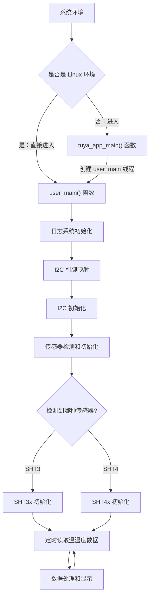

I2C（Inter-Integrated Circuit）即集成电路总线，是一种**串行通信协议**，用于连接微控制器和各种外设。I2C 使用两根信号线（SDA数据线和SCL时钟线）实现多主机、多从机的通信。

本示例的代码主要向开发者演示通过 I2C 接口读取温湿度传感器数据的功能。关于 I2C 接口的详细说明请查看: [TKL_I2C](https://www.tuyaopen.ai/zh/docs/tkl-api/tkl_i2c)。

## 使用指导

### 前置条件

由于每个开发平台上的资源不一样，并不会支持所有外设。
在编译运行该示例代码前，您需要检查 `board/<目标开发平台，如 T5AI>/TKL_Kconfig` 中确认使能配置是否默认打开：

```
config ENABLE_I2C
    bool
    default y
```

在运行本示例工程前要确认基础的 [环境搭建](https://www.tuyaopen.ai/zh/docs/quick-start/enviroment-setup) 已经完成。

### 选择配置文件

在编译示例工程之前需要根据自己的目标开发平台选择对应的配置文件。

- 进入本示例工程目录（假设当前路径是在 TuyaOpen 仓库的根目录下）, 请执行以下命令：

  ```shell
  cd examples/peripherals/i2c/sht3x_4x_sensor
  ```

- 进入选择配置文件的菜单，请执行以下命令：

  ```shell
  tos.py config choice
  ```

  命令执行完成后，终端会显示类似以下界面：

  ```
  --------------------
  1. BK7231X.config
  2. ESP32-C3.config
  3. ESP32-S3.config
  4. ESP32.config
  5. EWT103-W15.config
  6. LN882H.config
  7. T2.config
  8. T3.config
  9. T5AI.config
  10. Ubuntu.config
  --------------------
  Input "q" to exit.
  Choice config file: 
  ```

- 根据目标开发平台输入对应配置文件的编号然后按回车键。如选择 T5AI 平台，请输入数字 "9" 后回车键，终端会显示以下界面：

  ```shell
  Choice config file: 9
  [INFO]: Initialing using.config ...
  [NOTE]: Choice config: /home/share/samba/TuyaOpen/boards/T5AI/config/T5AI.config
  ```

### 运行准备

- **参数配置**

  I2C 的端口，引脚配置，温湿度传感器型号等参数可通过 Kconfig (配置文件路径：./Kconfig)配置。

  - 进入 Kconfig 配置菜单界面， 请执行以下命令：

    ```
    tos.py config menu
    ```

    命令执行完成后，终端会显示类似以下界面：

    ```
    configure project  --->
    Application config  --->
    Choice a board (T5AI)  --->
    configure tuyaopen  --->
    ```

  - 按上下方向键选择子菜单，选择应用配置子菜单 ( Application config ) 按回车键进入。

    进入应用配置的菜单后，终端会显示类似以下界面：

    ```shell
    (0) i2c port
    (13) scl pin
    (15) sda pin
        sensor type (sht3x)  --->
    ```
    
    工程会给定一个默认参数，如果您想修改配置可以按上下键选修改项，选定后按回车键可进行修改，修改完成后按Q键和Y键保存退出。

- **硬件连接**

  将温湿度传感器按照以下方式连接到开发板：

  | 传感器引脚 | 开发板引脚 | 说明 |
  |------------|------------|------|
  | VCC        | 3.3V       | 电源正极 |
  | GND        | GND        | 电源负极 |
  | SDA        | 配置的SDA引脚 | I2C数据线 |
  | SCL        | 配置的SCL引脚 | I2C时钟线 |

  **注意**: 
  - I2C 总线需要上拉电阻（通常4.7kΩ），部分传感器模块已集成
  - 确保传感器工作电压与开发板兼容（一般为3.3V）

### 编译烧录

- 编译工程，请执行以下指令：

  ```
  tos.py build
  ```

  工程编译成功后，终端会出现类似以下界面:

  ```
  [NOTE]: 
  ====================[ BUILD SUCCESS ]===================
   Target    : sht3x_4x_sensor_QIO_1.0.0.bin
   Output    : /home/share/samba/TuyaOpen/examples/peripherals/i2c/sht3x_4x_sensor/dist/sht3x_4x_sensor_1.0.0
   Platform  : T5AI
   Chip      : T5AI
   Board     : TUYA_T5AI_BOARD
   Framework : base
  ========================================================
  ```

- 烧录固件，请执行以下指令：

  ```
  tos.py flash
  ```

### 运行结果

- 查看日志，请执行以下指令：

  ```shell
  tos.py monitor
  ```

​	如果烧录和查看日志的步骤出现问题，请阅读 [烧录和日志](https://www.tuyaopen.ai/zh/docs/quick-start/firmware-burning) 。

- 如果 I2C 通信和传感器读取正常，会打印类似如下日志：

  ```
  [01-01 00:00:02 TUYA I][example_i2c.c:xx] sht3x temp:28.753, humi:44.455
  [01-01 00:00:04 TUYA I][example_i2c.c:xx] sht3x temp:28.589, humi:40.468
  [01-01 00:00:06 TUYA I][example_i2c.c:xx] sht3x temp:28.435, humi:37.937
  ```

## 示例说明

### 流程图



### 流程说明

1. 系统初始化：如果是 Linux 环境，直接调用 user_main()。其他环境则进入 tuya_app_main() 创建 user_main() 线程。
2. 调用 tal_log_init() 初始化日志系统。
3. 配置i2c 的时钟引脚和数据引脚的映射关系。
4. 调用 tkl_i2c_init() 函数对 I2C 总线进行初始化。
5. 通过读取设备ID或特征寄存器检测连接的传感器类型（SHT3x或SHT4x）。
6. 根据检测到的传感器类型进行相应的初始化配置。
7. 进入循环任务：定时读取传感器数据，进行数据处理和显示。

## 技术支持

您可以通过以下方法获得涂鸦的支持:

- TuyaOpen：https://www.tuyaopen.ai/zh

- GitHub：https://github.com/tuya/TuyaOpen