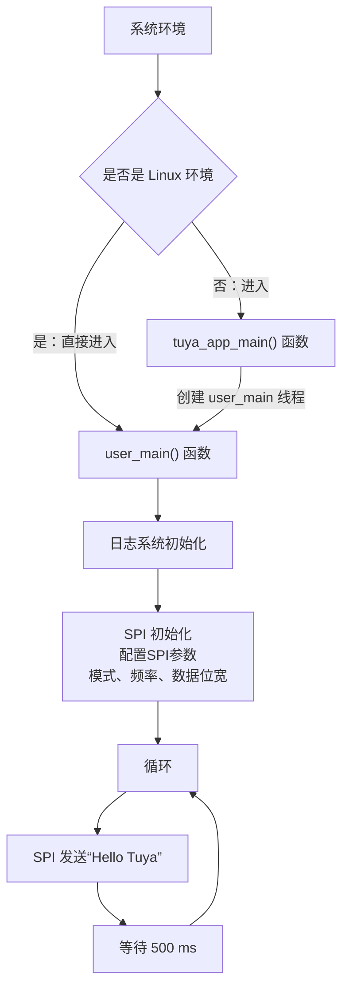

# SPI 串行外设接口

SPI（Serial Peripheral Interface）即串行外设接口，是一种**高速、全双工、同步**的串行通信协议。SPI 使用四根信号线（SCLK时钟线、MOSI主出从入、MISO主入从出、CS片选信号）实现主从设备间的数据传输。

本示例的代码主要向您演示模组作为主机通过 SPI 接口发送数据的功能。关于 SPI 接口的详细说明请查看: [TKL_SPI](https://www.tuyaopen.ai/zh/docs/tkl-api/tkl_spi)。

## 使用指导

### 前置条件

由于每个开发平台上的资源不一样，并不会支持所有外设。
在编译运行该示例代码前，您需要检查 `board/<目标开发平台，如 T5AI>/TKL_Kconfig` 中确认使能配置是否默认打开：

```
config ENABLE_SPI
    bool
    default y
```

在运行本示例工程前要确认基础的 [环境搭建](https://www.tuyaopen.ai/zh/docs/quick-start/enviroment-setup) 已经完成。

### 选择配置文件

在编译示例工程之前需要根据自己的目标开发平台选择对应的配置文件。

- 进入本示例工程目录（假设当前路径是在 TuyaOpen 仓库的根目录下）, 请执行以下命令：

  ```shell
  cd examples/peripherals/spi
  ```

- 进入选择配置文件的菜单，请执行以下命令：

  ```shell
  tos.py config choice
  ```

  命令执行完成后，终端会显示类似以下界面：

  ```
  --------------------
  1. BK7231X.config
  2. ESP32-C3.config
  3. ESP32-S3.config
  4. ESP32.config
  5. EWT103-W15.config
  6. LN882H.config
  7. T2.config
  8. T3.config
  9. T5AI.config
  10. Ubuntu.config
  --------------------
  Input "q" to exit.
  Choice config file: 
  ```

- 根据目标开发平台输入对应配置文件的编号然后按回车键。如选择 T5AI 平台，请输入数字 "9" 后回车键，终端会显示以下界面：

  ```shell
  Choice config file: 9
  [INFO]: Initialing using.config ...
  [NOTE]: Choice config: /home/share/samba/TuyaOpen/boards/T5AI/config/T5AI.config
  ```

### 运行准备

- **参数配置**

  SPI 的端口，时钟频率参数可通过 Kconfig (配置文件路径：./Kconfig)配置。

  - 进入 Kconfig 配置菜单界面， 请执行以下命令：

    ```
    tos.py config menu
    ```

    命令执行完成后，终端会显示类似以下界面：

    ```
    configure project  --->
    Application config  --->
    Choice a board (T5AI)  --->
    configure tuyaopen  --->
    ```

  - 按上下方向键选择子菜单，选择应用配置子菜单 ( Application config ) 按回车键进入。

    进入应用配置的菜单后，终端会显示类似以下界面：

    ```shell
    (0) spi port
    (20000000) spi baudrate
    ```
    
    工程会给定一个默认参数，如果您想修改配置可以按上下键选修改项，选定后按回车键可进行修改，修改完成后按Q键和Y键保存退出。
  
- **硬件连接**

  将上述配置端口的片选引脚 (cs) , 时钟引脚 (sck) , 输出引脚 (mosi) , 接到逻辑分析仪上。。

### 编译烧录

- 编译工程，请执行以下指令：

  ```
  tos.py build
  ```

  工程编译成功后，终端会出现类似以下界面:

  ```
  [NOTE]: 
  ====================[ BUILD SUCCESS ]===================
   Target    : spi_QIO_1.0.0.bin
   Output    : /home/share/samba/TuyaOpen/examples/peripherals/spi/dist/spi_1.0.0
   Platform  : T5AI
   Chip      : T5AI
   Board     : TUYA_T5AI_BOARD
   Framework : base
  ========================================================
  ```

- 烧录固件，请执行以下指令：

  ```
  tos.py flash
  ```

### 运行结果

- 查看日志，请执行以下指令：

  ```shell
  tos.py monitor
  ```

​	如果烧录和查看日志的步骤出现问题，请阅读 [烧录和日志](https://www.tuyaopen.ai/zh/docs/quick-start/firmware-burning) 。

- 如果程序运行正常，会打印类似如下日志：

  ```
  [01-01 00:00:01 ty N][example_spi.c:xx] spi send "Hello Tuya" finish
  ```


- 如果SPI各个引脚接上逻辑分析仪，可看到类似如下时序图：

  

## 示例说明

### 流程图



### 流程说明

1. 系统初始化：如果是 Linux 环境，直接调用 user_main()。其他环境则进入 tuya_app_main() 创建 user_main() 线程。
2. 调用 tal_log_init() 初始化日志系统。
3. 配置 SPI 的模式，频率， 数据位宽等参数并初始化。
4. 循环发送 “Hello Tuya”。    

## 技术支持

您可以通过以下方法获得涂鸦的支持:

- TuyaOpen：https://www.tuyaopen.ai/zh

- GitHub：https://github.com/tuya/TuyaOpen