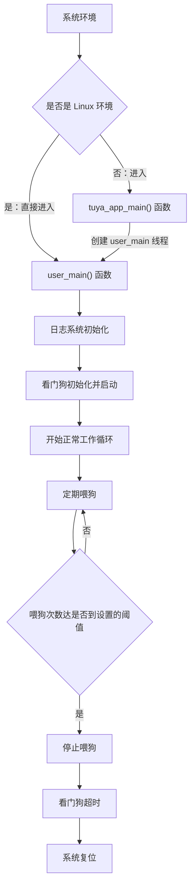

Watchdog（看门狗）是一种**硬件安全机制**，用于监控系统运行状态并在系统出现故障时自动复位系统。看门狗定时器需要软件定期"喂狗"（重置计数器），如果在规定时间内没有收到喂狗信号，看门狗就会认为系统出现故障并触发系统复位。

本示例的代码主要向您演示定时喂狗的操作。关于 Watchdog 接口的详细说明请查看: [TKL_WATCHDOG](https://www.tuyaopen.ai/zh/docs/tkl-api/tkl_watchdog)。

## 使用指导

### 前置条件

由于每个开发平台上的资源不一样，并不会支持所有外设。
在编译运行该示例代码前，您需要检查 `board/<目标开发平台，如 T5AI>/TKL_Kconfig` 中确认使能配置是否默认打开：

```
config ENABLE_WATCHDOG
    bool
    default y
```

在运行本示例工程前要确认基础的 [环境搭建](https://www.tuyaopen.ai/zh/docs/quick-start/enviroment-setup) 已经完成。

### 选择配置文件

在编译示例工程之前需要根据自己的目标开发平台选择对应的配置文件。

- 进入本示例工程目录（假设当前路径是在 TuyaOpen 仓库的根目录下）, 请执行以下命令：

  ```shell
  cd examples/peripherals/watchdog
  ```

- 进入选择配置文件的菜单，请执行以下命令：

  ```shell
  tos.py config choice
  ```

  命令执行完成后，终端会显示类似以下界面：

  ```
  --------------------
  1. BK7231X.config
  2. ESP32-C3.config
  3. ESP32-S3.config
  4. ESP32.config
  5. EWT103-W15.config
  6. LN882H.config
  7. T2.config
  8. T3.config
  9. T5AI.config
  10. Ubuntu.config
  --------------------
  Input "q" to exit.
  Choice config file: 
  ```

- 根据目标开发平台输入对应配置文件的编号然后按回车键。如选择 T5AI 平台，请输入数字 "9" 后回车键，终端会显示以下界面：

  ```shell
  Choice config file: 9
  [INFO]: Initialing using.config ...
  [NOTE]: Choice config: /home/share/samba/TuyaOpen/boards/T5AI/config/T5AI.config
  ```

### 运行准备

- **参数配置**

  Watchdog 的超时时间，喂狗间隔次数等参数可通过代码中的宏定义配置：

  ```c
  #define WATCHDOG_TIMEOUT_MS    (60 * 1000)    
  #define FEED_INTERVAL_CNT      (3)  
  #define WATCHDOG_REFRESH_CNT   (10)
  ```
  
- **硬件连接**

  看门狗是纯软件功能，不需要额外的硬件连接。如果需要观察复位效果，可以接日志看。


### 编译烧录

- 编译工程，请执行以下指令：

  ```
  tos.py build
  ```

  工程编译成功后，终端会出现类似以下界面:

  ```
  [NOTE]: 
  ====================[ BUILD SUCCESS ]===================
   Target    : watchdog_QIO_1.0.0.bin
   Output    : /home/share/samba/TuyaOpen/examples/peripherals/watchdog/dist/watchdog_1.0.0
   Platform  : T5AI
   Chip      : T5AI
   Board     : TUYA_T5AI_BOARD
   Framework : base
  ========================================================
  ```

- 烧录固件，请执行以下指令：

  ```
  tos.py flash
  ```

### 运行结果

- 查看日志，请执行以下指令：

  ```shell
  tos.py monitor
  ```

​	如果烧录和查看日志的步骤出现问题，请阅读 [烧录和日志](https://www.tuyaopen.ai/zh/docs/quick-start/firmware-burning) 。

- 如果看门狗工作正常，会打印类似如下日志：

  ```
  [01-01 00:00:00 ty N][example_watchdog.c:73] init watchdog, set interval: 60 sec, actual: 30 sec
  [01-01 00:00:10 ty N][example_watchdog.c:82] refresh watchdog, interval: 10 sec
  [01-01 00:00:20 ty N][example_watchdog.c:82] refresh watchdog, interval: 10 sec
  [01-01 00:00:30 ty N][example_watchdog.c:82] refresh watchdog, interval: 10 sec
  ```

## 示例说明

### 流程图



### 流程说明

1. 系统初始化：如果是 Linux 环境，直接调用 user_main()。其他环境则进入 tuya_app_main() 创建 user_main() 线程。
2. 调用 tal_log_init() 初始化日志系统。
3. 初始化看门狗。
4. 进入正常的系统工作循环，执行各种系统任务。
5. 在循环中定期进行喂狗操作。
6. 模拟喂狗次数达是否到设置的阈值，如果达到阈值就停止喂狗，以此来模拟故障状态。
7. 看门狗超时后触发系统复位。

## 技术支持

您可以通过以下方法获得涂鸦的支持:

- TuyaOpen：https://www.tuyaopen.ai/zh

- GitHub：https://github.com/tuya/TuyaOpen